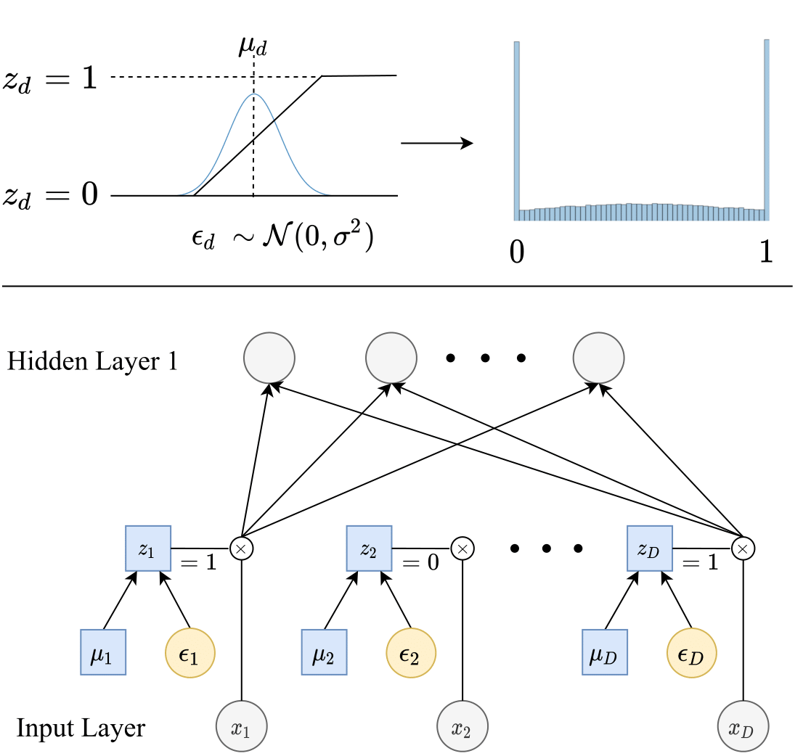

### Feature Selection Using Stochastic Gates (STG)

||
|:--:|
|Top: Each stochastic gate z_d is drawn from the STG approximation of the Bernoulli distribution (shown as the blue histogram on the right). Specifically, z_d is obtained by applying the hard-sigmoid function to a mean-shifted Gaussian random variable. Bottom: The z_d stochastic gate is attached to the x_d input feature, where the trainable parameter µ_d controls the probability of the gate being active|

